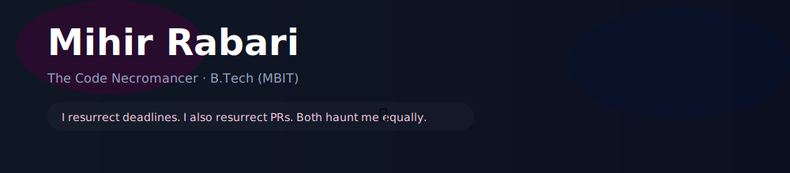
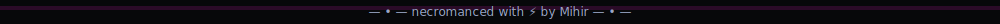
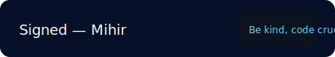

<!-- Header SVG -->

  

<!-- Stats badges row -->

  &nbsp;&nbsp;
  

<!-- Skill icons -->

  

<!-- Glitch divider -->

  

<!-- User content (preserved verbatim) -->
# Mihir Rabari: The Code Necromancer Who Raises Deadlines from the Grave 🪦💾

> "Cloning everything 'cause originality is overrated" 😈 – Why write fresh code when I can resurrect someone else’s repo and call it my own? Like a vampire sucking the life out of GitHub, I thrive in the dark. 🧛‍♂️

Yo, you curious code ghoul! 👻 I’m **Mihir Rabari**, a B.Tech Computer Engineering zombie (2024–2028, MBIT, CVM University) who shambles through codebases, leaving a trail of chaos and commits. By day, I’m crafting systems that make hackers cry harder than a server crash at 3 AM. By night? I’m debugging why my life’s stuck in a segmentation fault. 💀 *Core dumped, feelings dumped.*

If you’re here, you’re either lost in my repos (RIP your sanity) or wondering if I can build your startup before it flatlines. Spoiler: I can, but only if it’s written in Rust, ‘cause my code’s rusty and my humor’s crusty. 🦀😏

## Why My Code’s the Grim Reaper of Greatness 💀😎

My apps don’t just run; they haunt your servers with efficiency so deadly, you’ll need an exorcist to stop them. I’m the guy who makes your MVP feel like an RIP – Rest In Production. ⚰️

- **Mission:** Turn your half-baked ideas into code so hot it burns the cloud. 🔥
- **Unique Selling Proposition (USP):** I write code that outlives my relationships. My last PR got more love than my Tinder profile. 😢
- **Free Trial:** Star a repo, get a virtual middle finger salute. Or a bug fix. Same vibe.
- **Pricing:** Free for open-source, but my soul’s sold separately. 💸👹

Dark Roast: My B.Tech? It’s just me surviving four years of caffeine overdoses and crying over null pointers. My profs? They’re still recovering from my “it works locally” excuses. 😴

## Achievements: Where I Bury the Competition 🪓🏆

I’ve hacked more thons than a graveyard has tombstones. Here’s my trophy crypt, with a side of self-inflicted burns:

- **IntelliHack 25’ (DA-IICT):** 🥇 Slaughtered 700+ teams with Team “Fantastic Four” (Khushi Trivedi, Rajput Laukik, Janvi Patel – the only ones keeping my corpse animated). Mentored by Mr. Sunit Parmar, who probably needs therapy now. Snagged ₹21,000 – enough to buy a coffin for my imposter syndrome. Beating 700 teams? That’s more bodies than my commit history. [Proof or I’m a ghost](https://www.mbit.edu.in/?page_id=19776) [Insta haunt](https://www.instagram.com/p/DPDUa2KD9aj/) [FB séance](https://www.facebook.com/MBIT.CVMUniversity/posts/proud-achievement-for-mbitteam-fantastic-four-from-mbit-cvm-university-secured-1/1369712495163697/)

- **CVMU Hackathon 2025:** Finalist. Didn’t crash and burn – unlike my attempts at adulting. 💥

- **DevSummit 2025:** 6th Place with AI Firewall (99.88% Threat Detection). My firewall blocks threats better than I block my ex’s texts. 🛡️📴

- **OdooxCharusat Hackathon:** Top 75. Not top 10, but I showed up, which is more than my Wi-Fi does. 📡🙄

- **International Recognition:** Mental arithmetic skills. I calculate failure rates faster than you can say “divide by zero.” 🧮💣

Dark Fact: These wins prove I’m a champ... in code. IRL? I’m still losing at “find a date who doesn’t ghost.” 👻

## Skillset: My Arsenal of Doom 🖤🛠️

I’m armed with a tech stack so lethal, it could crash your hopes and dreams. Here’s what I wield:

- **Primary Languages:** Rust (tougher than my last breakup), JavaScript (chaotic like my sleep schedule), Python (sneaky like my 2 AM commits), TypeScript (safe, unlike my life decisions).

- **Backend:** Node.js, Express (express delivery to production hell), Rust async (faster than my descent into madness), WebSocket (real-time misery sharing).

- **Frontend:** React, Next.js (next-level nightmares), TailwindCSS (looking good while falling apart), TypeScript (no runtime errors, just existential ones).

- **Databases:** MongoDB (noSQL, no soul), PostgreSQL (structured chaos), Redis (caches my pain).

- **Dev Tools:** Docker (trapping bugs like my emotions), Linux (penguin vibes only), Git (commit or commit to therapy), VS Code (my only stable relationship).

- **Cloud & Deployment:** Firebase (burning my bugs), Vercel (ver-cursed), Cloudflare (flaring up security).

- **Distributed Systems:** Apache Kafka (streaming my screams), Apache Pulsar (pulsing with despair).

- **Security & AI:** Network Security (guarding your backend like it’s Fort Knox), AI tools (smarter than my life choices), DNS-level security (domain domination, baby).

- **Other Weapons:** Prisma (pretty but deadly), WebGL (visuals to distract from bugs), WASM (web assembly, not witchcraft... or is it?), Async Rust Libraries (multi-threaded mayhem).

Dark Roast: With this stack, I should be a millionaire. Instead, I’m just rich in error logs and existential dread. 😵

## Major Projects: My Army of Undead Creations 🧟‍♂️🚀

| Project                | Description (With Dark Humor)                                                    | Stack                          | Status        | Roast Level 🔥 |
|------------------------|--------------------------------------------------------------------------------|--------------------------------|---------------|----------------|
| ved-db-server          | High-performance Rust in-memory DB. Stores data faster than I forget my ex.    | Rust, Async, CLI               | Built         | In-memory? Like my short-term memory after a hackathon. 🧠💥 |
| VedDB Rust Client      | Async Rust client + CLI. Connects better than I do with humans.                | Rust, WebSocket                | Built         | More stable than my Wi-Fi... and my emotions. 😭 |
| CodeDog                | AI-powered Supply Chain Threat Detection. Barks at threats, not at me.         | Node.js, AI                    | Built         | Loyal unlike my last collaborator. 🐶😡 |
| Bookmarks Hub          | Full-stack Bookmarks Manager. Saves links, not my soul.                        | Express, MongoDB, React        | Built         | Bookmarked your heart? Nah, you ghosted. 👻🔖 |
| Ride-Hauling SaaS      | Transportation/Taxi SaaS. Uber, but with more bugs than a haunted swamp.       | Next.js, Node.js, MongoDB      | Building      | Hauling rides? More like hauling my regrets. 🚕😢 |
| flameNGen              | Visual Scripting Game Engine. Build games without coding... like a coward.     | Rust, WebGL, Custom scripting  | In Progress   | Flaming hot? Or just my CPU crying for mercy? 🔥💻 |
| Smart Attendance System| College attendance viz (Heatmaps, Dashboards). Tracks skips better than I do.  | Python, TS, React              | Prototyping   | Smart? Unlike my decision to pull an all-nighter. 📊😴 |
| HackHunt               | Hackathon Discovery Platform. Finds hacks easier than finding my purpose.       | Express, Firebase              | Research      | Hunting hacks? I’m hunted by deadlines. 🏹😱 |
| Bhai ka DNS            | Scalable DNS firewall for hackathons. Protects better than my antivirus.       | Pulsar, System Documentation   | Built         | DNS? Do Not Survive my bad code. 😈 |

Each project is a resurrected corpse of late-night coding. Want to adopt one? Open an issue, not my coffin. ⚰️📩

## Personal Vibes: The Ghoul Behind the Code 🖤😈

- **Coding Habits:** Daily commits, hackathon junkie, prototypes faster than I run from responsibility. (Roast: I prototype apps, not life plans. 🙃)
- **Interests:** Web dev, AI, DNS tech, UI/UX, startup ideas, coding at vampire hours. Also, memes and existential crises.
- **Humor/Personality:** Darker than my VS Code theme, “adulting” like a zombie – half-dead but still moving. I’m the guy who laughs at 500 errors and cries at 404s.
- **Networking:** Haunting dev platforms, open to collabs, mentorships, or just roasting bad code over coffee. ☕🪦

Dark Fact: Mental arithmetic skills? I calculate how fast my life’s spiraling: 88 MPH straight to the void. 🕳️

Roast: 8 GitHub followers? My grandma’s knitting club has a bigger fanbase. 🧶🤡

## Stats: Proof I’m Not Just a Poltergeist 📊👻

- **Followers:** 8 – Enough for a séance, not a cult.
- **Following:** 2 – I’m picky, like my linter.
- **Pinned Projects:** ved-db-server (my pride and joy... with 2 stars ⭐😅).
- **Squad Goals:** Khushi, Laukik, Janvi – The real necromancers. Mentor Sunit: Sorry for the nightmares.

Stats update live, unlike my social life. 📉

## Summon Me: Let’s Cause Some Chaos 📫😈

- **LinkedIn:** [Creep on my professional side](https://www.linkedin.com/in/mihir-rabari/)
- **GitHub:** You’re here, star something or I’ll haunt your PRs. 👻
- **Email:** contact@mihirrabari.dev – Subject: “Your code gave me chills”

Open to internships, collabs, or roasting your bad regex. Recruiters: My CV’s ready, but it’s got more bugs than my first app. 🐞😄

> Motto: In a world of crashes, be the stack trace. If all else fails, `git push --force` and run. 🏃‍♂️💨

All this chaos was summoned from my GitHub [github.com/Mihir-Rabari](https://github.com/Mihir-Rabari), hackathon tombstones, and a pinch of dark magic. Want a CV or pitch? I’ll make it so dark it’ll need a content warning. 😈

<!-- Bottom badge -->

  

